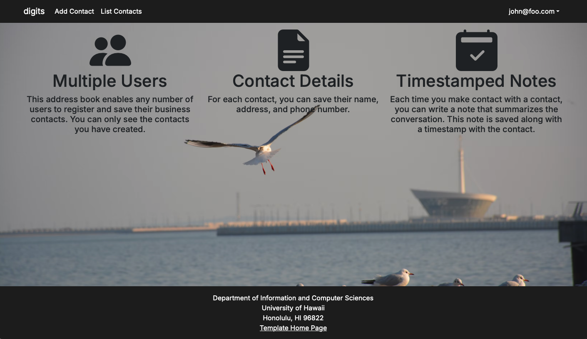

## Installation

First, download a copy of Digits. 

Clone this, then run npm install and npm run dev to run the application.

## Walkthrough

### Landing Page

An overview of the features of the page. 

This includes features like being able to see different users information, contact details, and notes with timestamps.

### Register

You can register for an account by clicking on Login, and then Sign up. Enter your password and email to register.

You can also sign out and change your password.

### User home page

You can now see a list of contacts.

### Edit contacts

You can edit users contact information.

### Timestamped Notes

You can add notes with information about them and your interactions with them.

### Admin

You can assign one or more users with Admin roles, which allows them to see a list of all contacts. 

